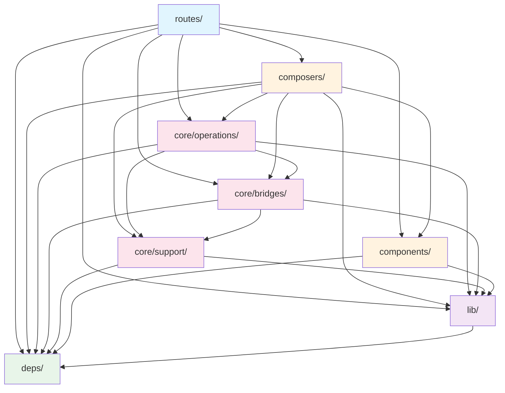

# Development Guide

## Prerequisites

- **pnpm**
- **Node.js** 24+ (via `pnpm env use 24`)

## Directories Overview

```
sandbox/              # Developer scratch space (gitignored)
app/
├── routes/           # Application routes (controllers), handle requests and orchestration
├── composers/        # Server Component helpers that orchestrate Effects + UI
├── components/       # Reusable UI components (client and server)
├── core/             # Business logic layer (Effects only, no React/JSX, no Promises)
│   ├── bridges/      # Thin Effect wrappers for external systems (DB, APIs)
│   ├── operations/   # Shared orchestration logic (extracted from routes when needed)
│   └── support/      # Core-specific utilities and helpers
├── lib/              # Domain-agnostic utilities (could be extracted to packages)
├── deps/             # Re-exports of dependencies (aliasing, augmenting exports)
```

## Directories Import Rules

The project follows a strict import hierarchy to maintain clean architecture boundaries:



**Import Rules:**

- **`routes/`** → composers, core/bridges, core/operations, core/support, components, lib, deps
- **`composers/`** → core/bridges, core/operations, core/support, components, lib, deps
- **`components/`** → lib, deps
- **`core/operations/`** → core/bridges, core/support, lib, deps
- **`core/bridges/`** → core/support, lib, deps
- **`core/support/`** → lib, deps
- **`lib/`** → deps
- **`deps/`** → (self-contained, foundation layer)
- **Root `app/` files** → No restrictions

## CRITICAL: Server vs Client Code Separation in React Router RSC

When using React Router with RSC (React Server Components) mode, it's crucial to understand how imports work:

### Server Code in Client Components

**Problem:** Importing server-side modules (with database clients, Node.js APIs, etc.) into client components causes runtime errors in the browser.

**Key Rules:**

1. **Route files with `export const ServerComponent`** - These run on the server, can safely import server code
2. **Regular route files and client components** - These run in the browser, must NOT import server code
3. **Root-level files like `root.tsx`** - These are client components by default

**Solution:** Use type-only imports when client components need types from server modules:

```typescript
// ❌ BAD - Imports server runtime code into client
import { Route } from '#composers/route'

// ✅ GOOD - Only imports TypeScript types
import type { Route } from '#composers/route'
```

**Example Error:** If you see errors like:

- `GelError at Object.createClient` in the browser
- `(0 , import_module.createRequire) is not a function`
- Node.js-only APIs failing in browser

Check if a client component is importing server modules without the `type` keyword.

## Core Architecture

### Philosophy: Fat Routes, Thin Bridges

This project follows a **fat routes** pattern where routes act as controllers, owning their orchestration logic and queries. We extract to shared layers only when duplication emerges.

### Core Structure

```
core/
├── bridges/          # Thin Effect wrappers for ALL external systems
│   ├── db/           # EdgeDB/Gel Effect wrapper (our database)
│   ├── railway/      # Railway GraphQL Effect wrapper
│   └── stripe/       # Stripe API Effect wrapper (example)
├── operations/       # Shared orchestration logic (extracted from routes)
└── support/          # Core-specific utilities and helpers
```

### Layer Responsibilities

#### Routes (Controllers)

- **Own all orchestration logic** for their specific needs
- **Build queries directly** using bridges
- **Transform data** for their views
- **Handle errors** specific to their context
- **Start here** - only extract when patterns emerge

#### Bridges

- **Thin mechanical wrappers** that convert external APIs to Effects
- **Transform errors** to domain error types
- **Inject authentication** tokens or credentials
- **Provide consistent interfaces** (all return Effects)
- **NO business logic** - purely mechanical transformations

#### Operations

- **Extracted orchestration** shared between multiple routes
- **Complex multi-step processes** that need isolation
- **Reusable workflows** between routes and API endpoints
- **Only create when needed** - avoid premature extraction

#### Support

- **Core-specific utilities** not general enough for lib/
- **Domain helpers** used by operations and bridges
- **Internal types and schemas** for core layer

### When to Use Each Layer

**Keep logic in routes when:**

- It's specific to that route's needs
- It's simple data fetching/transformation
- It's unlikely to be reused
- You're exploring/prototyping
- The query shape is view-specific

**Extract to operations when:**

- Multiple routes need identical orchestration
- API endpoints duplicate route logic
- Complex multi-step processes emerge
- Logic needs isolated testing
- A clear workflow pattern emerges

**Bridges should only:**

- Wrap promises in Effects
- Transform external errors to domain errors
- Inject authentication/headers
- Provide type-safe interfaces
- Never contain business logic

### Anti-patterns to Avoid

❌ **Smart Bridges**

```typescript
// BAD - Business logic in bridge
class RailwayBridge {
  getTemplatesForMarketplace() { ... }  // View-specific method
  getTemplatesWithStats() { ... }        // Combining multiple calls
}
```

❌ **Premature Operations**

```typescript
// BAD - Single-use operation
core / operations
    / get - user - profile.ts // Only used by one route
```

❌ **View-aware Bridges**

```typescript
// BAD - Bridge knows about UI concerns
db.project.findForDashboard() // Dashboard is a view concern
```

✅ **Correct Pattern**

```typescript
// Route owns orchestration
export const ServerComponent = Route.Server(function*() {
  // Build exact query needed
  const templates = yield* railway.query.templates({
    first: 50,
    where: { active: true },
  })

  // Transform for view
  const enriched = addMarketplaceMetadata(templates)
  return <Marketplace templates={enriched} />
})
```

## Directory Rules

### Core

| Rule                                                                                                      | Why                                    |
| --------------------------------------------------------------------------------------------------------- | -------------------------------------- |
| No React/JSX                                                                                              | Pure business logic                    |
| Return (meaning public API) Effects (not Promises)                                                        | Statically track errors, composability |
| Bridges stay thin and mechanical                                                                          | Avoid business logic leak              |
| Operations only for shared orchestration                                                                  | Avoid premature abstraction            |
| Uses [lib-style layout](https://github.com/jasonkuhrt/claude/blob/main/docs/conventions/library-local.md) | Predictable imports                    |

### Lib-Style Import Convention

When importing from modules that follow lib-style layout:

- **External imports**: Use base path only (e.g., `import { Foo } from '#core/support/settings'`)
  - The module's `$.ts` exports the namespace
  - The module's `$$.ts` exports individual items
  - TypeScript resolves to the appropriate export via package.json exports field
- **Never** append `/$.ts` or `/$$.ts` to import paths from outside the module
- **Internal imports** (within same module): Can use `./$$.js` for barrel or `./$.js` for namespace

### Bridge Import Examples

```typescript
// In routes
import { db } from '#core/bridges/db'
import { railway } from '#core/bridges/railway'

// Use directly
const project = yield* db.project.findById(id)
const template = yield* railway.query.template({ id })
```

## Tool Resources

- [React Router Docs](https://reactrouter.com)
- [React Router RSC Guide](https://reactrouter.com/how-to/react-server-components)
- [Graffle Docs](https://graffle.js.org)
- [Railway API Docs](https://docs.railway.com/reference/public-api)
- [Radix Themes](https://www.radix-ui.com/themes/docs)

## Setup

See [README.md](./README.md) for initial setup instructions.

```bash
# Generate all code
pnpm gen          # Run all generators in parallel
```

## Code Generation

This project uses multiple code generators to maintain type safety:

### All Generators (`pnpm gen`)

**What:** Runs all `gen:*` scripts in parallel.

**When to run:**

- Initial setup
- After pulling changes that affect routes or schemas
- Before committing to ensure all types are up to date

### React Router Typegen (`pnpm gen:routes`)

**What:** Generates TypeScript types for routes and route loaders.

**When to run:**

- After creating/modifying route files in `app/routes/`
- Before type checking if routes changed

**Why:** Provides autocomplete and type safety for `useLoaderData()`, route params, and navigation.

**Output:** `.react-router/types/` directory

### Railway Client (`pnpm gen:railway`)

**What:** Introspects Railway's GraphQL API and generates a fully typed client.

**When to run:**

- Initial setup
- When Railway API schema changes (rare)
- After updating `graffle.config.ts`

**Why:**

- Type-safe Railway API access with autocomplete
- No manual GraphQL query strings needed
- Automatic type inference for query results

**Output:** `app/lib/railway/__generated__/` directory (gitignored)

**Config:** `graffle.config.ts`

**Usage:**

```typescript
import { Railway } from '#lib/railway'

// Use environment variable (MAGLEV_RAILWAY_API_TOKEN or RAILWAY_API_TOKEN)
const railway = Railway.create()

// Or pass explicitly
const railway = Railway.create({ apiToken: 'your-token' })

// Query API with full type safety
const projects = await railway.query.projects({
  // Fully typed fields and arguments
})
```

# Scripts

## Running the App

```bash
# Development server (with HMR)
pnpm dev
# Production build
pnpm build
# Production server
pnpm start
```

## Quality Checks

```bash
# Run all checks
pnpm check
# # Run all fixers
pnpm fix
```

# Tips

## Type Checking Flow

- Alaways have code generated before chasing type errors
- Package scripts should automate this for you.

## Styling

### Use Design Tokens

| ❌ Don't              | ✅ Do                             |
| --------------------- | --------------------------------- |
| `fontSize: '14px'`    | `fontSize: '{fontSizes.sm}'`      |
| `padding: '16px'`     | `padding: '{spacing.4}'`          |
| `color: '#000'`       | `color: '{colors.black}'`         |
| `border: '1px solid'` | `borderWidth: '{borders.1}'`      |
| `width: '200px'`      | `width: '{sizes.sidebar}'`        |
| `maxWidth: '800px'`   | `maxWidth: '{sizes.containerMd}'` |

# Future Considerations

## Component Primitives

### Ark UI Integration

Currently, we're using Panda CSS with custom components. As needs grow we could consider Ark UI which is built by same team and supports React RSC.

[Ark UI](https://ark-ui.com/) by Chakra Systems provides headless, accessible UI components that could complement our Panda CSS setup:

- **45+ accessible components** with full keyboard navigation and ARIA support
- **Framework agnostic** - supports React, Vue, and Solid
- **Headless design** - style with Panda CSS or any styling solution
- **RSC compatible** - Components that need interactivity can be marked as client components

**Integration Options:**

1. **Direct Ark UI usage** - Import Ark components and style with Panda CSS
2. **Park UI** - Pre-styled Ark + Panda components (currently v3 in development: https://github.com/cschroeter/park-ui/issues/519)

**Example with Panda CSS:**

```tsx
import { Select } from '@ark-ui/react'
import { styled } from '../styled-system/jsx'

const StyledSelect = styled(Select.Root, {
  base: {
    // Panda CSS styles
  },
})
```

This approach would give us robust, accessible components while maintaining our Panda CSS design system and RSC compatibility.

## Art Direction & Design System

This application follows a **stark Swiss International Style** design philosophy. Core Principles:

- **Grid-based layouts**: Everything aligns to a clear grid system
- **Bold typography**: Strong, uppercase headings with generous letter-spacing
- **Monochromatic palette**: Only black and white, no grays
- **Minimal ornamentation**: No gradients, shadows, or decorative elements
- **Sharp corners**: Maximum 2px border radius (prefer 0)
- **High contrast**: Instant inversions on hover states

And:

- Use Panda CSS design tokens from `panda.config.ts`
- Prefer semantic tokens over hardcoded values
- Components should be stark, functional, and brutalist
- No animations or transitions unless absolutely necessary
